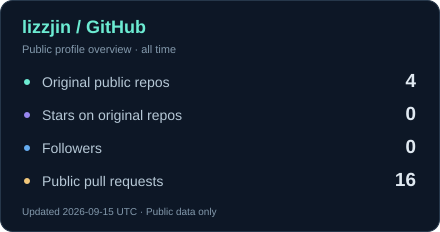
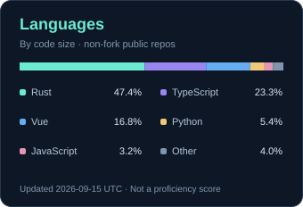

  <a href="./README.md">简体中文</a> · <strong>English</strong>

  

### Hi, I'm Zane 👋

Also known as **lizzjin**. I'm focused on **agent development**, turning ideas into projects of my own.

I'm interested in how agents can go beyond conversation to participate in real workflows and complete concrete tasks.

### Now

- **Focus** · Agent development
- **In progress** · Building personal projects, experimenting and iterating
- **Up next** · Project introductions and usage guides when they're ready

## Toolbox

  
  
  
  
  
  
  
  

Tools and exploration areas for agent development.

<!-- Selected work is reserved for projects that are ready to share. Keep this section hidden until then. -->

### Activity

  
  

  

GitHub and language cards are stored in this repository and scheduled to refresh public data daily. Language shares are not proficiency scores. The streak card still uses a third-party service.

<!-- Add a blog, public email or social links only after they have been confirmed. -->

---

  Think · Build · Iterate

