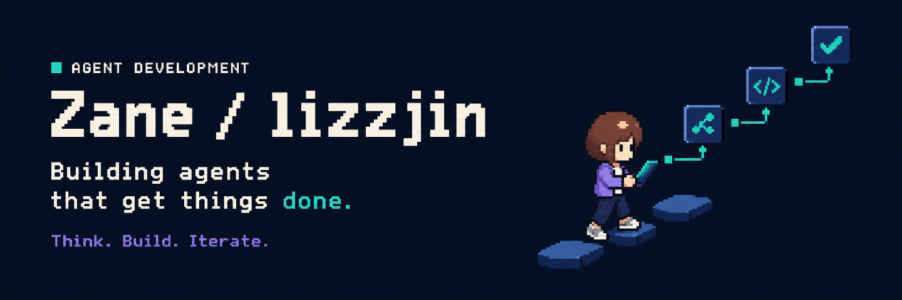

  <strong>简体中文</strong> · <a href="./README.en.md">English</a>

  

### Hi, I'm Zane 👋

你也可以叫我 **lizzjin**。我专注于 **Agent 开发**，正在把想法变成自己的项目。

比起停留在对话，我更想探索 Agent 如何参与实际工作、完成具体任务。

### Now / 正在做

- **专注方向** · Agent 开发
- **当前状态** · 打磨个人项目，持续尝试与迭代
- **接下来** · 项目准备好后，在这里补充介绍与使用方式

## Toolbox

  
  
  
  
  
  
  
  

用于 Agent 开发的工具与探索方向。

<!--
项目展示区域暂不显示。首个项目准备好后，在这里加入：

### Selected work / 项目

#### [项目名称](项目链接)

一句话说明项目解决的问题。

补充真实技术栈，以及可用的演示或文档链接。
-->

### Activity / 开源足迹

  
  

  

卡片由第三方服务生成，可能存在缓存延迟或暂时不可用；语言统计不等于个人能力评价。

<!-- 博客、公开邮箱和社交链接确认后再添加，不使用占位联系方式。 -->

---

  Think · Build · Iterate

